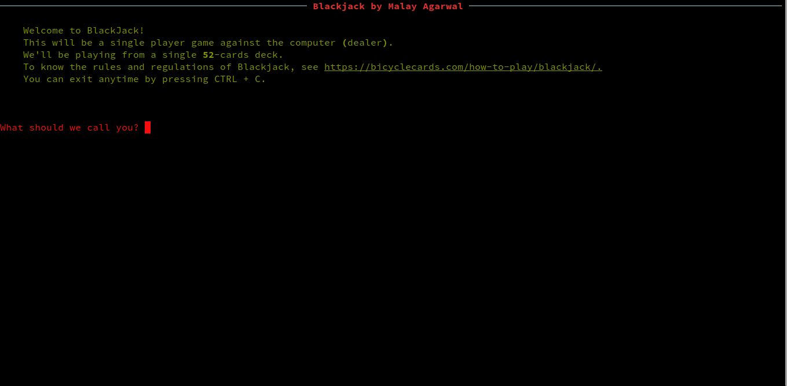

# <!-- omit in TOC --> Table of Contents

- [Blackjack](#blackjack)
  - [Start Playing](#start-playing)
  - [Sample Game](#sample-game)

# Blackjack

A simple Python program which emulates a game of Blackjack.

## Start Playing

To play, `cd` to the project directory and execute the following:

- Install requirements

```console
$ pip install -r requirements.txt
```

- Play!

```console
$ python driver.py
```

## Sample Game


